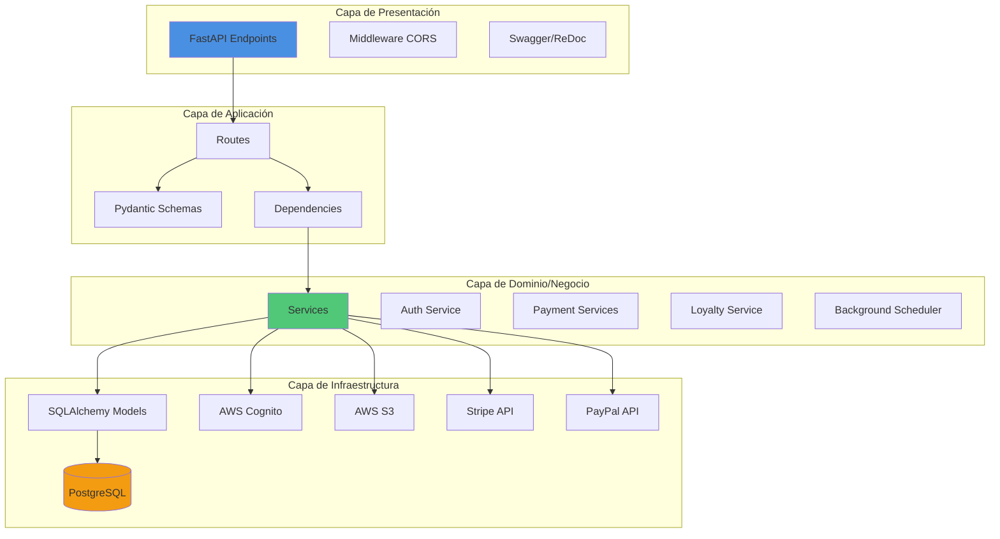
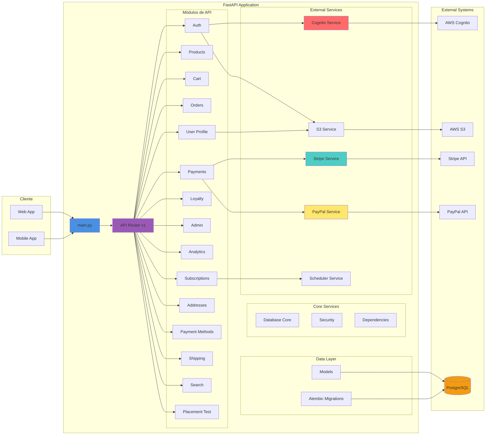
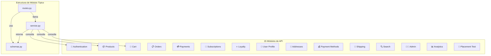
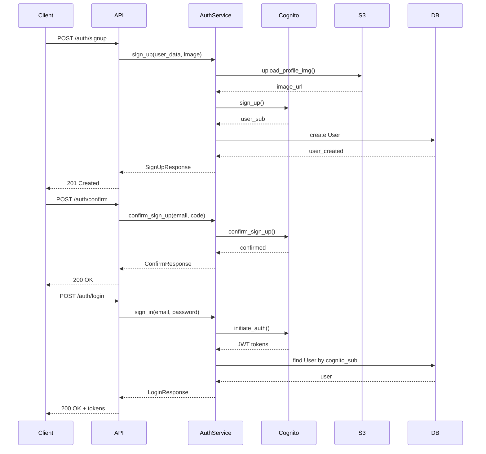
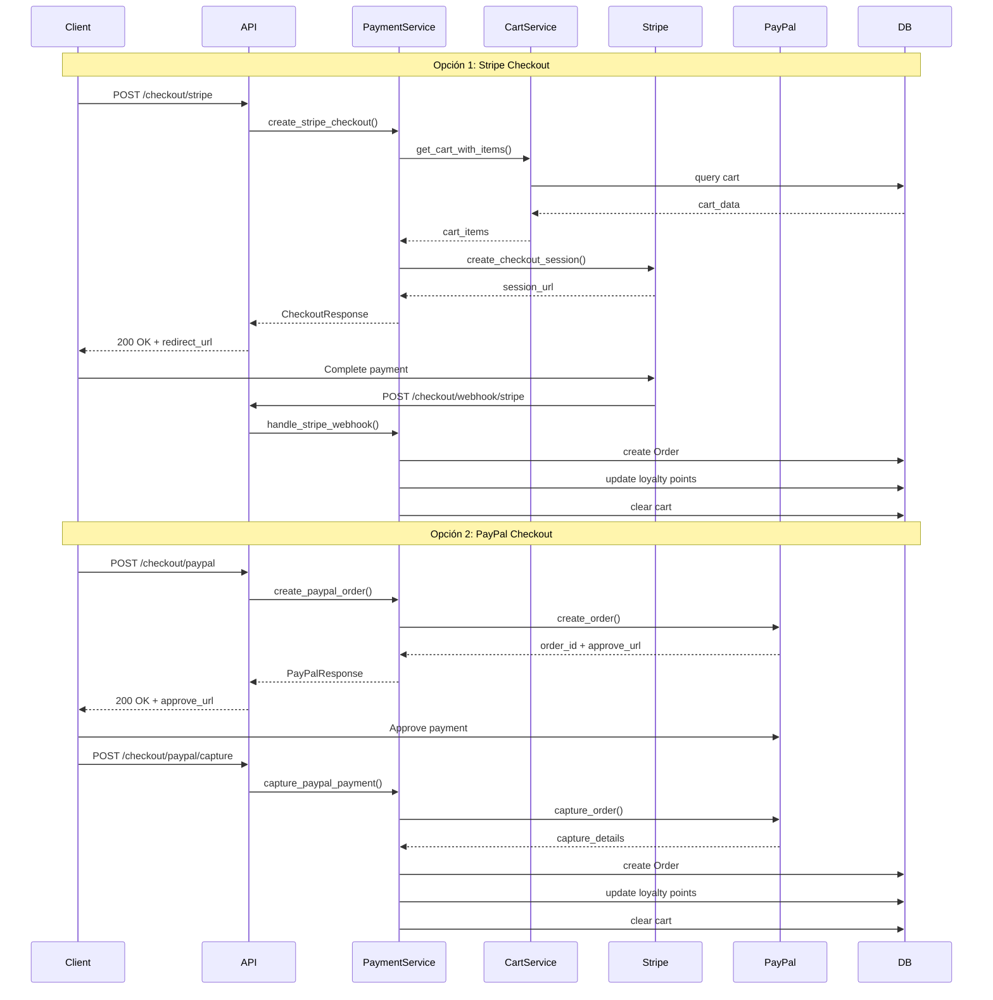
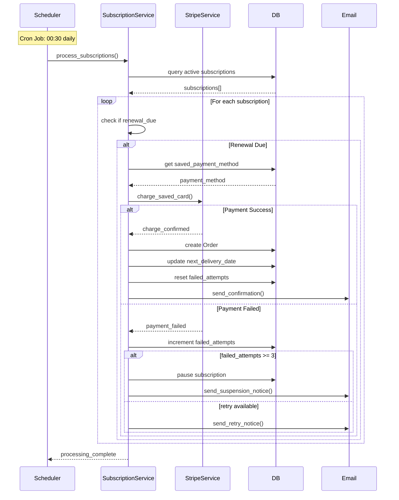
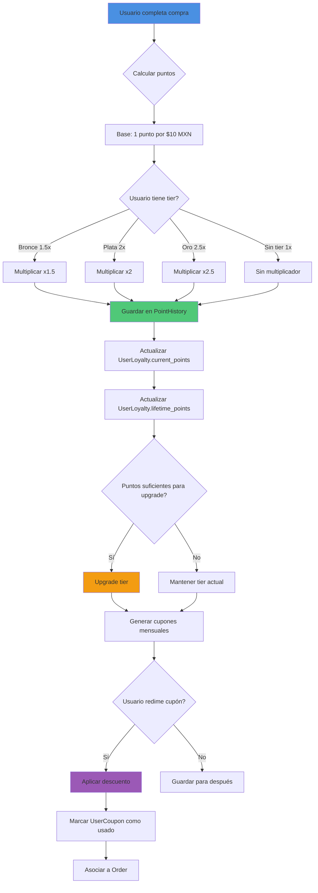
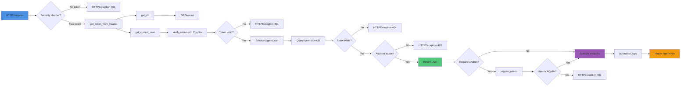
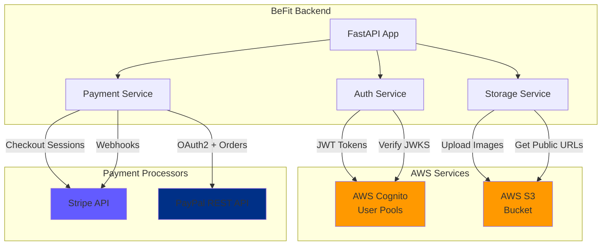

# 🏗️ Arquitectura del Backend BeFit

**Proyecto**: T1-MFDS 2025 Backend (BeFit - Fitness E-Commerce Platform)
**Framework**: FastAPI
**Fecha**: 2025-11-19
**Versión**: 1.0.0

---

## 📑 Tabla de Contenidos

1. [Visión General](#-visión-general)
2. [Arquitectura en Capas](#-arquitectura-en-capas)
3. [Arquitectura de Componentes](#-arquitectura-de-componentes)
4. [Módulos de la API](#-módulos-de-la-api)
5. [Flujos de Procesos Principales](#-flujos-de-procesos-principales)
6. [Modelo de Base de Datos](#-modelo-de-base-de-datos)
7. [Integraciones Externas](#-integraciones-externas)
8. [Patrones y Principios](#-patrones-y-principios)

---

## 🎯 Visión General

BeFit Backend es una aplicación FastAPI que implementa una plataforma de e-commerce especializada en fitness y nutrición. La arquitectura sigue principios de **Clean Architecture** y **SOLID**, con clara separación de responsabilidades en capas.

### Características Principales

- ✅ Autenticación con AWS Cognito
- ✅ Procesamiento de pagos (Stripe & PayPal)
- ✅ Almacenamiento en S3 (AWS)
- ✅ Sistema de suscripciones automáticas
- ✅ Programa de lealtad y puntos
- ✅ Gestión completa de órdenes y envíos
- ✅ Analytics y reportes para administradores
- ✅ Migraciones de base de datos con Alembic

---

## 📚 Arquitectura en Capas

La aplicación está organizada en una arquitectura de **4 capas principales**:



### Descripción de Capas

#### 1️⃣ **Capa de Presentación** (`app/main.py`, `/api`)
- **Responsabilidad**: Exponer endpoints HTTP y manejar requests/responses
- **Componentes**:
  - FastAPI application instance
  - CORS Middleware
  - Health check endpoints
  - Documentación automática (Swagger/ReDoc)

#### 2️⃣ **Capa de Aplicación** (`app/api/v1/*/routes.py`)
- **Responsabilidad**: Orquestar flujos de negocio y validación de datos
- **Componentes**:
  - Route handlers (controllers)
  - Pydantic schemas (validación)
  - Dependency injection (auth, db session)

#### 3️⃣ **Capa de Dominio/Negocio** (`app/api/v1/*/service.py`, `app/services/`)
- **Responsabilidad**: Lógica de negocio y reglas de dominio
- **Componentes**:
  - Services (business logic)
  - Integration services (Stripe, PayPal, S3, Cognito)
  - Background job scheduler
  - Business rules y calculations

#### 4️⃣ **Capa de Infraestructura** (`app/models/`, `app/core/`)
- **Responsabilidad**: Persistencia y acceso a servicios externos
- **Componentes**:
  - SQLAlchemy ORM models
  - Database engine y sessions
  - External API clients
  - File storage

---

## 🧩 Arquitectura de Componentes



---

## 🔌 Módulos de la API

Todos los módulos siguen el patrón **Routes → Service → Models**:



### Detalle de Endpoints por Módulo

| Módulo | Prefix | Endpoints | Descripción |
|--------|--------|-----------|-------------|
| **Authentication** | `/auth` | 9 endpoints | Registro, login, confirmación email, reset password |
| **Products** | `/products` | 4 endpoints | Catálogo, detalles, productos relacionados, reviews |
| **Cart** | `/cart` | 5 endpoints | Agregar, actualizar, eliminar items, checkout |
| **Orders** | `/orders` | 4 endpoints | Listar, crear, detalles, actualizar status |
| **Payments** | `/checkout` | 5 endpoints | Resumen, checkout Stripe/PayPal, webhooks |
| **Subscriptions** | `/subscriptions` | 4 endpoints | CRUD suscripciones, pausar/reanudar |
| **Loyalty** | `/loyalty` | 5 endpoints | Puntos, tier, historial, cupones, beneficios |
| **User Profile** | `/profile` | 4 endpoints | Ver/actualizar perfil, fitness profile |
| **Addresses** | `/addresses` | 4 endpoints | CRUD direcciones de envío/facturación |
| **Payment Methods** | `/payment-methods` | 3 endpoints | Listar, guardar, eliminar métodos de pago |
| **Shipping** | `/shipping` | 2 endpoints | Rastreo, calcular costo de envío |
| **Search** | `/search` | 1 endpoint | Búsqueda con filtros avanzados |
| **Admin** | `/admin` | 8+ endpoints | CRUD usuarios y productos (admin only) |
| **Analytics** | `/analytics` | 4 endpoints | Reportes de ventas, revenue, comportamiento |
| **Placement Test** | `/placement-test` | Variable | Test de evaluación fitness |

---

## 🔄 Flujos de Procesos Principales

### 1. Flujo de Autenticación



### 2. Flujo de Checkout y Pago



### 3. Flujo de Suscripciones Automáticas



### 4. Flujo de Programa de Lealtad



### 5. Flujo de Dependency Injection



---

## 🗄️ Modelo de Base de Datos

### Diagrama de Entidad-Relación

```mermaid
erDiagram
    User ||--o{ Order : places
    User ||--|| ShoppingCart : has
    User ||--o{ Address : has
    User ||--o{ PaymentMethod : has
    User ||--|| FitnessProfile : has
    User ||--|| UserLoyalty : has
    User ||--o{ Review : writes
    User ||--o| Subscription : has
    User ||--o{ UserCoupon : redeems

    Product ||--o{ ProductImage : has
    Product ||--o{ CartItem : in
    Product ||--o{ OrderItem : in
    Product ||--o{ Review : receives

    ShoppingCart ||--o{ CartItem : contains

    Order ||--o{ OrderItem : contains
    Order }o--|| Address : ships_to
    Order }o--o| PaymentMethod : paid_with
    Order }o--o| Coupon : applies
    Order }o--o| Subscription : from
    Order ||--o{ Review : has
    Order ||--o| PointHistory : earns

    Subscription }o--|| FitnessProfile : based_on
    Subscription }o--|| PaymentMethod : charges
    Subscription ||--o{ Order : generates

    UserLoyalty }o--|| LoyaltyTier : belongs_to
    UserLoyalty ||--o{ PointHistory : tracks

    LoyaltyTier ||--o{ UserLoyalty : has

    Coupon ||--o{ UserCoupon : redeemed_by

    UserCoupon }o--o| Order : used_in

    User {
        int user_id PK
        string role
        string email UK
        string password_hash
        string cognito_sub UK
        string stripe_customer_id
        string first_name
        string last_name
        string gender
        date date_of_birth
        string profile_picture
        boolean account_status
        datetime created_at
    }

    Product {
        int product_id PK
        string name
        text description
        string brand
        string category
        json physical_activities
        json fitness_objectives
        text nutritional_value
        decimal price
        int stock
        decimal average_rating
        boolean is_active
        datetime created_at
        datetime updated_at
    }

    Order {
        int order_id PK
        int user_id FK
        int address_id FK
        int payment_id FK
        int coupon_id FK
        int subscription_id FK
        boolean is_subscription
        datetime order_date
        string order_status
        string tracking_number
        decimal subtotal
        decimal discount_amount
        decimal shipping_cost
        decimal total_amount
        int points_earned
    }

    Subscription {
        int subscription_id PK
        int user_id FK
        int profile_id FK
        int payment_method_id FK
        string subscription_status
        date start_date
        date end_date
        date next_delivery_date
        boolean auto_renew
        decimal price
        date last_payment_date
        int failed_payment_attempts
    }

    UserLoyalty {
        int user_id PK_FK
        int tier_id FK
        int current_points
        int lifetime_points
        date tier_upgrade_date
    }

    LoyaltyTier {
        int tier_id PK
        int tier_level UK
        int min_points_required
        decimal points_multiplier
        decimal free_shipping_threshold
        int monthly_coupons_count
        decimal coupon_discount_percentage
    }

    PointHistory {
        int history_id PK
        int user_id FK
        int order_id FK
        string event_type
        int points_amount
        datetime created_at
    }
```

### Relaciones Clave

| Relación | Tipo | Descripción |
|----------|------|-------------|
| User ↔ ShoppingCart | 1:1 | Cada usuario tiene un carrito activo |
| User ↔ Subscription | 1:0..1 | Usuario puede tener máximo una suscripción |
| User ↔ UserLoyalty | 1:1 | Sistema de lealtad obligatorio |
| Order ↔ Subscription | N:0..1 | Orden puede ser parte de suscripción |
| Subscription ↔ Order | 1:N | Suscripción genera múltiples órdenes |
| UserLoyalty ↔ LoyaltyTier | N:1 | Múltiples usuarios en cada tier |
| Order → PointHistory | 1:0..1 | Orden puede generar puntos |

---

## 🔗 Integraciones Externas



### Detalles de Integración

#### AWS Cognito
- **Propósito**: Gestión de identidad y autenticación
- **Flujos**: Sign up, sign in, email confirmation, password reset
- **Tokens**: Access token (30 min), ID token, Refresh token
- **Verificación**: JWT con RS256 usando JWKS (caché 1 hora)

#### AWS S3
- **Propósito**: Almacenamiento de archivos
- **Contenido**: Imágenes de perfil, imágenes de productos
- **Validación**: Max 5MB, formatos JPEG/PNG/WEBP
- **Procesamiento**: Auto-resize a 1024x1024 px

#### Stripe
- **Propósito**: Procesamiento de pagos
- **Métodos**: Checkout hosted, Payment Intents, Setup Intents
- **Webhooks**: `payment_intent.succeeded`, `payment_failed`, `dispute.created`
- **Metadata**: Order ID, user ID, cart items

#### PayPal
- **Propósito**: Procesamiento de pagos alternativo
- **Flujo**: OAuth2 → Create Order → Capture
- **Moneda**: MXN (Pesos mexicanos)
- **Environment**: Sandbox/Live configurable

---

## 🎨 Patrones y Principios

### Patrones de Diseño Implementados

#### 1. **Service Layer Pattern**
```
Routes → Service → Models
```
- **Beneficio**: Separación de responsabilidades
- **Ubicación**: Cada módulo en `/api/v1/{module}/service.py`

#### 2. **Dependency Injection**
```python
def endpoint(
    db: Session = Depends(get_db),
    current_user: User = Depends(get_current_user)
):
    # business logic
```
- **Beneficio**: Testabilidad y bajo acoplamiento
- **Ubicación**: `app/api/deps.py`

#### 3. **Repository Pattern** (Implícito)
- **Implementación**: Services actúan como repositories
- **Beneficio**: Abstracción de acceso a datos

#### 4. **Factory Pattern**
- **Uso**: Creación de servicios (Stripe, PayPal, S3)
- **Beneficio**: Configuración centralizada

#### 5. **Strategy Pattern**
- **Uso**: Múltiples métodos de pago (Stripe, PayPal)
- **Beneficio**: Extensibilidad para nuevos procesadores

### Principios SOLID

| Principio | Implementación |
|-----------|----------------|
| **S**ingle Responsibility | Cada service tiene una responsabilidad única |
| **O**pen/Closed | Extensible con nuevos módulos sin modificar core |
| **L**iskov Substitution | Models heredan de SQLAlchemy Base correctamente |
| **I**nterface Segregation | Schemas específicos por endpoint |
| **D**ependency Inversion | Dependencias inyectadas, no hardcodeadas |

### Clean Architecture

```
┌─────────────────────────────────────┐
│         Presentation Layer          │  ← FastAPI Routes
├─────────────────────────────────────┤
│         Application Layer           │  ← Schemas, Dependencies
├─────────────────────────────────────┤
│           Domain Layer              │  ← Services, Business Logic
├─────────────────────────────────────┤
│       Infrastructure Layer          │  ← Models, External APIs
└─────────────────────────────────────┘
```

---

## 📦 Estructura de Archivos Detallada

```
Backend/
├── alembic/                          # Database migrations
│   ├── versions/
│   │   └── ab46214e3156_migracion_a_postgres.py
│   ├── env.py
│   └── script.py.mako
│
├── app/
│   ├── main.py                       # ⚡ FastAPI app entry
│   ├── config.py                     # ⚙️ Settings & env vars
│   │
│   ├── api/
│   │   ├── deps.py                   # 💉 DI: get_db, get_current_user, require_admin
│   │   └── v1/
│   │       ├── router.py             # 🔀 Main router (aggregates all modules)
│   │       │
│   │       ├── auth/                 # 🔐 Authentication
│   │       │   ├── routes.py
│   │       │   ├── schemas.py
│   │       │   └── service.py        # CognitoService
│   │       │
│   │       ├── products/             # 📦 Product catalog
│   │       │   ├── routes.py
│   │       │   ├── schemas.py
│   │       │   └── service.py
│   │       │
│   │       ├── cart/                 # 🛒 Shopping cart
│   │       │   ├── routes.py
│   │       │   ├── schemas.py
│   │       │   └── service.py
│   │       │
│   │       ├── orders/               # 📋 Order management
│   │       │   ├── routes.py
│   │       │   ├── schemas.py
│   │       │   └── service.py
│   │       │
│   │       ├── payments/             # 💳 Payment processing
│   │       │   ├── routes.py
│   │       │   ├── schemas.py
│   │       │   └── service.py
│   │       │
│   │       ├── subscriptions/        # 🔄 Subscriptions
│   │       │   ├── routes.py
│   │       │   ├── schemas.py
│   │       │   └── service.py
│   │       │
│   │       ├── loyalty/              # ⭐ Loyalty program
│   │       │   ├── routes.py
│   │       │   ├── schemas.py
│   │       │   └── service.py
│   │       │
│   │       ├── user_profile/         # 👤 User profile
│   │       │   ├── routes.py
│   │       │   ├── schemas.py
│   │       │   └── service.py
│   │       │
│   │       ├── address/              # 📍 Address management
│   │       ├── payment_method/       # 💰 Payment methods
│   │       ├── analytics/            # 📊 Analytics & reports
│   │       ├── search/               # 🔍 Product search
│   │       ├── admin/                # 👨‍💼 Admin endpoints
│   │       ├── shipping/             # 🚚 Shipping & tracking
│   │       └── placement_test/       # 📝 Placement test
│   │
│   ├── core/
│   │   ├── database.py               # 🗄️ SQLAlchemy engine & session
│   │   ├── security.py               # 🔒 Password hashing
│   │   └── aws_cognito.py            # (Empty - logic in auth service)
│   │
│   ├── models/                       # 📊 ORM Models (19 files)
│   │   ├── user.py
│   │   ├── product.py
│   │   ├── order.py
│   │   ├── subscription.py
│   │   ├── loyalty_tier.py
│   │   ├── user_loyalty.py
│   │   ├── point_history.py
│   │   ├── shopping_cart.py
│   │   ├── cart_item.py
│   │   ├── order_item.py
│   │   ├── address.py
│   │   ├── payment_method.py
│   │   ├── coupon.py
│   │   ├── user_coupon.py
│   │   ├── review.py
│   │   ├── fitness_profile.py
│   │   ├── product_image.py
│   │   └── enum.py                   # Enums: UserRole, OrderStatus, etc.
│   │
│   ├── services/                     # 🔧 External integrations
│   │   ├── stripe_service.py         # Stripe API
│   │   ├── paypal_service.py         # PayPal API
│   │   ├── s3_service.py             # AWS S3
│   │   └── scheduler.py              # APScheduler (background jobs)
│   │
│   └── utils/
│       └── helpers.py                # (Empty - utility functions)
│
├── tests/
│   ├── conftest.py                   # pytest fixtures
│   ├── test_products.py
│   ├── test_cart.py
│   └── test_admin.py
│
├── alembic.ini                       # Alembic config
├── requirements.txt                  # Dependencies
├── pytest.ini                        # pytest config
├── seed_data.py                      # Database seeding
└── ARCHITECTURE.md                   # 📖 This file
```

---

## 🚀 Notas de Implementación

### Background Jobs (Scheduler)

El sistema utiliza **APScheduler** para ejecutar tareas programadas:

```python
# Jobs configurados:
1. expire_loyalty_points()  → 00:00 daily
2. process_subscriptions()  → 00:30 daily
```

**Funcionalidad**:
- ✅ Expiración automática de puntos antiguos
- ✅ Procesamiento de suscripciones y cobros automáticos
- ✅ Creación de órdenes recurrentes
- ✅ Manejo de fallos de pago (3 intentos → pausar)

### Seguridad

#### Autenticación
- JWT tokens validados con JWKS de Cognito
- Caché de 1 hora para reducir llamadas a AWS
- Access token expira en 30 minutos

#### Autorización
- Role-based access control (ADMIN, USER)
- Dependency injection para verificar permisos
- DEV_MODE bypass para desarrollo

#### Validación de Datos
- Pydantic schemas para request/response
- Validación automática de tipos
- Email validator para correos

#### Password Security
- bcrypt para hashing (10 rounds)
- No se almacenan passwords en texto plano
- Cognito maneja políticas de password

### Performance

#### Database
- Índices en: `user_id`, `email`, `cognito_sub`, `product_id`
- Relationships con lazy loading (optimizable con eager loading)
- Connection pooling de SQLAlchemy

#### Caching
- JWKS cache (1 hora TTL)
- Sin implementación de Redis (recomendado para producción)

#### Async Operations
- PayPal service usa `httpx.AsyncClient`
- S3 uploads son síncronos (mejorables con aioboto3)

---

## 📋 Checklist de Mejoras Futuras

### Escalabilidad
- [ ] Implementar Redis para caché
- [ ] Migrar de APScheduler a Celery + Redis
- [ ] Implementar rate limiting
- [ ] Agregar health checks detallados

### Seguridad
- [ ] Implementar refresh token rotation
- [ ] Agregar CSRF protection
- [ ] Implementar audit logs
- [ ] Agregar API key authentication para servicios

### Observabilidad
- [ ] Integrar Sentry para error tracking
- [ ] Agregar métricas con Prometheus
- [ ] Implementar distributed tracing (OpenTelemetry)
- [ ] Logs estructurados con JSON

### Testing
- [ ] Aumentar cobertura de tests (>80%)
- [ ] Agregar integration tests
- [ ] Implementar contract testing
- [ ] Agregar performance tests

### DevOps
- [ ] Dockerización completa
- [ ] CI/CD pipeline
- [ ] Infrastructure as Code (Terraform)
- [ ] Auto-scaling configuration

---

## 📚 Referencias

- [FastAPI Documentation](https://fastapi.tiangolo.com/)
- [SQLAlchemy ORM](https://docs.sqlalchemy.org/)
- [AWS Cognito Developer Guide](https://docs.aws.amazon.com/cognito/)
- [Stripe API Reference](https://stripe.com/docs/api)
- [PayPal REST API](https://developer.paypal.com/api/rest/)

---

**Última actualización**: 2025-11-19
**Versión del documento**: 1.0.0
**Mantenido por**: Equipo BeFit Backend
